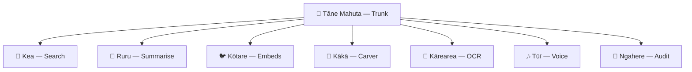

# 🌲 Ngahere-OS - Living Forest of Kaitiaki

Ngahere-OS is a living forest system where kaitiaki (guardian birds) serve as AI-powered utilities, each embodying the spirit and purpose of native New Zealand birds. The system is sustained by Tāne Mahuta (the forest god) and powered by the rito (heart of the forest).

## 🐦 Kaitiaki (Native Birds)

Each kaitiaki acts as a utility/service in the backend, wrapping functions with the spirit of its role:

- **🦅 Kārearea (NZ Falcon)**: Sharp sight — OCR scanning of PDFs and images
- **🦉 Ruru (Morepork)**: Wisdom in the night — summarisation, memory recall
- **🐦 Kōtare (Sacred Kingfisher)**: Quick strike — embeddings and fast recall
- **🦅 Kea**: Curious trickster — testing, debugging, stress checking, searching
- **🦜 Kākā**: Noisy carver — carving code and patterns into shape
- **🎶 Tūī**: Voice of the ngahere — text-to-speech, translation, reo flows
- **🌲 Ngahere**: The forest itself — audit trail, recording every manu's flight

## 🏗️ Architecture



## 🚀 Quick Start

### Prerequisites
- Python 3.8+
- Git
- Supabase account (for vector storage)
- OpenAI API key (for AI features)
- Ollama (optional, for local LLM)

### Installation

1. **Clone the repository**
   ```bash
   git clone <your-repo-url>
   cd Ngahere-OS
   ```

2. **Set up environment**
   ```bash
   # Copy environment template
   cp env.template .env
   
   # Edit .env with your API keys
   # SUPABASE_URL=your_supabase_url
   # SUPABASE_KEY=your_supabase_key
   # OPENAI_API_KEY=your_openai_key
   ```

3. **Install dependencies**
   ```bash
   # For development
   ./ngahere_os.sh dev
   
   # Or manually
   pip install -r dev-requirements.txt
   ```

4. **Run the forest**
   ```bash
   ./ngahere_os.sh run
   ```

The API will be available at `http://localhost:8000`

## 📚 API Endpoints

- **Kea** (`/kea`) - Search and testing utilities
- **Ruru** (`/ruru`) - Summarization services  
- **Kākā** (`/kaka`) - Code generation and carving
- **Kōtare** (`/kotare`) - Embedding and vector storage
- **Kārearea** (`/karearea`) - OCR and image scanning
- **Tūī** (`/tui`) - Text-to-speech and voice
- **Ngahere** (`/ngahere`) - Audit logging and provenance

## 🛠️ Development Status

### ✅ Completed
- FastAPI application structure
- Kaitiaki class implementations (basic)
- Router system for all endpoints
- Configuration files and prompts
- Environment setup

### 🚧 In Progress
- Supabase integration for Kōtare
- OCR implementation for Kārearea
- AI integration for Ruru
- TTS implementation for Tūī

### 📋 Roadmap
- Complete kaitiaki implementations
- Database schema setup
- Comprehensive testing
- Production deployment
- Documentation and guides

## 🌿 Cultural Framework

This project honors Māori concepts of kaitiakitanga (guardianship) and the interconnectedness of the natural world. Each kaitiaki embodies the characteristics and wisdom of their bird counterparts, creating a culturally-grounded AI system that respects both technology and tradition.

## 📄 License

See LICENSE file for details.
